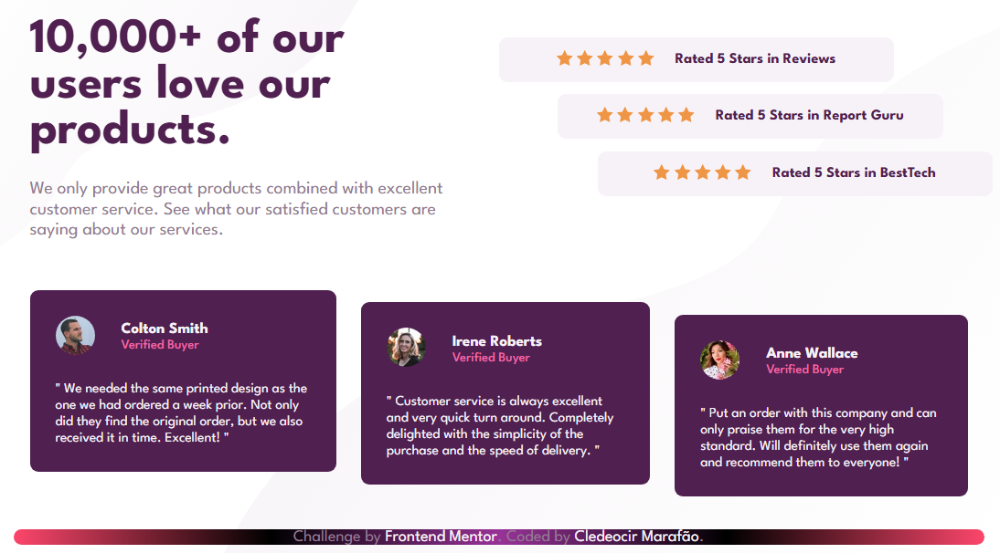
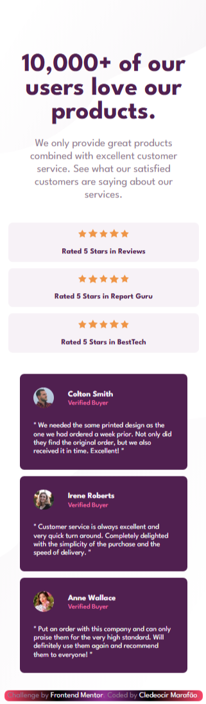

# 📣 Social Proof Section

Um componente de interface responsivo que destaca avaliações de clientes, desafio proporcionado pelo [Frontend Mentor](https://www.frontendmentor.io). Construído com HTML e CSS puro, o layout simula uma seção de prova social frequentemente encontrada em landing pages modernas.

## 🔗 Link do projeto online

[🔍 Acesse aqui no GitHub Pages]()

## ✨ Funcionalidades

- Layout totalmente responsivo (desktop e mobile)
- Avaliações e Cartões com efeito cascata
- Interatividade visual com hover e transições suaves
- Estrutura HTML semântica e acessível
- Design 100% fiel ao desafio original

## 🛠 Tecnologias utilizadas

- HTML5 🧱
- CSS3 🎨
- Media Queries 📱

## Ferramentas utilizadas

- Google Fonts
- Font Awesome
- CSS Grid & Flexbox 📐

---

## 📸 Captura de tela

### 💻 Versão Desktop

[]

### 📱 Versão Mobile

[]

## 🧠 O que aprendi

- Melhor uso de semântica HTML.
- Dupla aplicação de Background.

## 📌 Desafio

Este projeto foi baseado no desafio [Social Proof Section](https://www.frontendmentor.io/challenges/social-proof-section-6e0qTv_bA) da plataforma [Frontend Mentor](https://www.frontendmentor.io).

---

## 🧑‍🎓 Desenvolvedor

Desenvolvido por [Cledeocir Marafão](https://www.linkedin.com/in/cledeocir-maraf%C3%A3o-267768193/) 👾

[](https://github.com/cledeocirmarafao)
[](https://www.linkedin.com/in/cledeocir-maraf%C3%A3o-267768193/)

---

## 🗂️ Status do projeto

✅ Finalizado

### 🚀 Quer rodar localmente?

```bash
git clone https://github.com/cledeocirmarafao/projeto-social-proof-section.git
cd social-proof-section
# Abra o arquivo index.html no navegador
```
